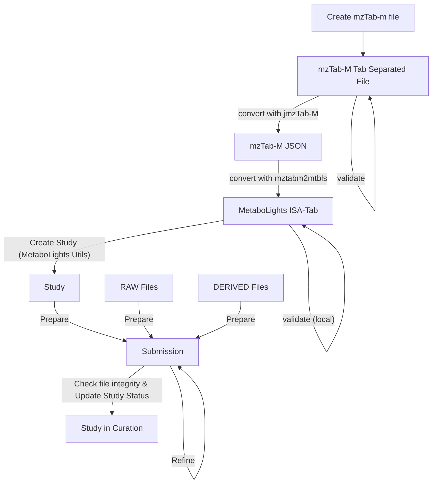

# Conversion of mzTab-m to ISA-Tab MetaboLights

This repository contains a Python library to convert mzTab-m files to ISA-Tab files for MetaboLights submission.
Due to the differences in the respective formats, the conversion is not straightforward. The library is designed to handle the conversion of mzTab-m files to ISA-Tab files for MetaboLights submission. Some information that is currently not supported by the ISA-Tab format is converted into comments, where possible. The library is designed to be extensible, so that additional information can be converted in the future.

## Installation


```bash

# install python package manager uv
curl -LsSf https://astral.sh/uv/install.sh | sh

# add $HOME/.local/bin to your PATH, either restart your shell or run
export PATH=$HOME/.local/bin:$PATH

# Mac command
# brew install git

# clone project from github
git clone https://github.com/EBI-Metabolights/mztabm2mtbls.git

cd mztabm2mtbls

# install python if it is not installed
uv python install 3.13

# install python dependencies
uv sync

# open your IDE (vscode, pycharm, etc.) and set python interpreter as .venv/bin/python

```

## Usage

At the moment, this library uses the JSON representation of the mzTab-m file. The JSON representation can be generated using the jmztab-m tool. The easiest way to generate the JSON representation is to use the Docker container provided by BioContainers.

### Create mztab2-m json file from mztab file

Please ensure that mzTab-m files exist in the working directory:

```bash
docker pull quay.io/biocontainers/jmztab-m:1.0.6--hdfd78af_1
# Example of how to run the container to convert lipidomics-example.mzTab file on current working directory to lipidomics-example.mzTab.json file
docker run --rm -v "${PWD}":/home/data:rw --workdir /home/data quay.io/biocontainers/jmztab-m:1.0.6--hdfd78af_1 jmztab-m -c "/home/data/lipidomics-example.mzTab" --toJson -o "/home/data/validation.txt"
```

The container will accept an mzTab-M file with the `-c` flag and output a JSON file with the `--toJson` flag. The JSON file will be created in the same directory as the input file. The `-o` flag can be used to specify the output file name for the validation results. This will run a default validation on the mzTab-M file, without semantic validation. 

You can also run the conversion with semantic validation of the mzTab-M file activated as follows, supplying a mapping xml file with the `-s` flag:

```bash
docker run --rm -v "${PWD}":/home/data:rw --workdir /home/data quay.io/biocontainers/jmztab-m:1.0.6--hdfd78af_1 jmztab-m -c "/home/data/lipidomics-example.mzTab" --toJson -o "/home/data/validation.txt" -s /home/data/mappingFile.xml
```

Mapping file examples can be found in the mztab-m repository: https://github.com/HUPO-PSI/mzTab/blob/master/specification_document-releases/2_0-Metabolomics-Release 

Please note that for submission to MetaboLights, the mzTab-M file must comply with the minimal profile for MetaboLights. The semantic validation mapping file for the minimal profile can be found in the mztab-m repository.

TODO: Add link to the minimal profile mapping file.

### Workflow overview

1. Create an mzTab-m file with your tool / library of choice.
2. Convert the mzTab-m file to a JSON file using the jmztab-m tool or the docker container.
3. Use the converter.py script to convert the JSON file to an ISA-Tab file (mztabm2mtbls).
4. Validate the ISA-Tab file using the metabolights_utils package.
5. Submit the ISA-Tab files to MetaboLights as a new study.
6. Sync and validate the submission.
7. Success!



### Run converter for example file

```bash
PYTHONPATH=. uv run python mztabm2mtbls/converter.py --input-file submission_validation_test/MTBLS263/MTBLS263.mztab --mtbls_accession_number MTBLS100001
```

### Run converter without remote validation

Install following requirements before running local validation

- Ensure docker daemon is running
- Download OPA agent https://www.openpolicyagent.org/docs/latest/#1-download-opa

```bash
    # Download opa for Mac (Apple Silicon)
    curl -L -o opa https://openpolicyagent.org/downloads/latest/opa_darwin_arm64
    chmod 755 ./opa
    ./opa version

    # ALTERNATIVE DOWNLOADS 
    ############################################################################
    # Download opa linux (AMD version)
    curl -L -o opa https://openpolicyagent.org/downloads/latest/opa_linux_amd64
    # ARM64 version
    # curl -L -o opa https://openpolicyagent.org/downloads/latest/opa_linux_arm64
    chmod 755 ./opa
    ./opa version
    ############################################################################

    ############################################################################
    # Download opa linux (AMD version)
    curl -L -o opa.exe https://openpolicyagent.org/downloads/latest/opa_windows_amd64.exe
    opa.exe version
    ############################################################################
    
```

```bash
rm -rf bundle.tar.gz
curl -L -o bundle.tar.gz https://github.com/EBI-Metabolights/mtbls-validation/raw/test/bundle/bundle.tar.gz
PYTHONPATH=. uv run python commands/validate_study.py \
        --mtbls_provisional_study_id=MTBLS263 \
        --target_metadata_files_path=output/MTBLS263 \
        --data_files_path=test/data/MTBLS263/FILES \
        --mztabm_file_path=test/data/MTBLS263/mztabm/MTBLS263.mztab \
        --mztabm_validation_level=Error \
        --mtbls_validation_bundle_path=./bundle.tar.gz \
        --opa_executable_path=./opa \
        --temp_folder=output/temp \
        --config_file=test/data/configurations/mztabm2mtbls_config.json
```


### Run converter with mapping file

```bash
PYTHONPATH=. uv run python commands/validate_study.py \
        --mtbls_provisional_study_id=MTBLS263 \
        --target_metadata_files_path=output/MTBLS263 \
        --data_files_path=test/data/MTBLS263/FILES \
        --mztabm_file_path=test/data/MTBLS263/mztabm/MTBLS263.mztab \
        --mztabm_mapping_file=test/data/configurations/mzTab_2_0-M_mapping.xml \
        --mztabm_validation_level=Error \
        --mtbls_validation_bundle_path=./bundle.tar.gz \
        --opa_executable_path=./opa \
        --temp_folder=output/temp \
        --config_file=test/data/configurations/mztabm2mtbls_config.json
```

### Setting the validation level for the mzTab-M validation

Use the `--mztabm_validation_level` parameter to set the validation level for the mzTab-M validation. The default value is `Info`, if the argument is not provided. The possible values are `Error`, `Warning`, and `Info`. If set to `Info`, any info, warning or error level validation messages will lead to a failure of the validation. If set to `Warning`, only warning and error level validation messages will lead to a failure of the validation. If set to `Error`, only error level validation messages will lead to a failure of the validation. Generally, it is recommended to set the validation level to `Warning` to ensure that the mzTab-M file is at least compliant with the MetaboLights minimal profile. However, using `Info` will provide more detailed information about potential improvements of the mzTab-M file metadata. Please note that these levels apply to both the basic validation performed by the jmztab-m tool and the semantic validation performed when an [Mapping file](https://github.com/HUPO-PSI/mzTab/blob/master/specification_document-releases/2_0-Metabolomics-Release/mzTab_2_0-M_mapping.xml) is provided with the `--mztabm_mapping_file` parameter.


# Conversion, Validation and Upload Process

Converted ISA tab files will be in the output folder.
The script will generate different validation files in the output folder. 
The first validation file will be the validation of the mzTab-m JSON file. If this validation stage passes without warnings or errors, the script will proceed to the conversion of the JSON file to ISA-Tab. The second validation file will be the validation of the ISA-Tab file against the MetaboLights validation REST API. If this validation stage passes without warnings or errors, the script will proceed to the submission of the ISA-Tab files to MetaboLights.
In a final step, raw and derived files will be uploaded to the MetaboLights FTP server.

## Structuring mzTab-M files for conversion

MetaboLights requires a specific structure for mzTab-M files to be converted correctly. This requires specific metadata to be present in the mzTab-M file. In contrast to MetaboLights study, that can have multiple assays, mzTab-M files are expected to contain only one assay, corresponding to the application of one analytical method to a set of samples. Please note that the term "assay" is used differently in the context of mzTab-M files, where it refers to the material derived from a sample used for measurement with a mass spectrometry workflow. The MS workflow may contain multiple steps, e.g. chromatography.